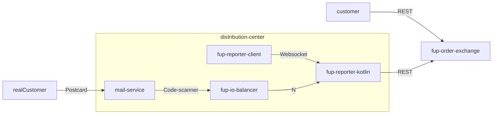
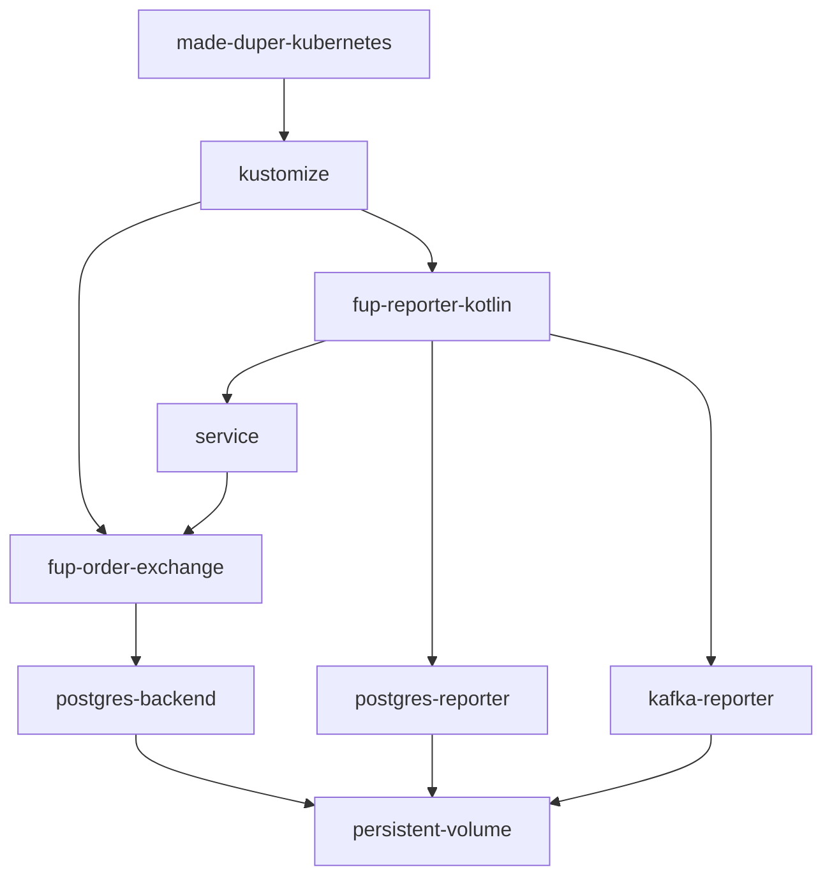
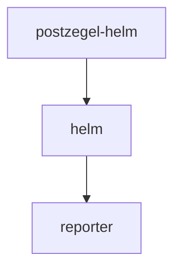

# funicular-postcard (fup)

The goal of the project is to understand how things work.
Not a real purpose, other than I found a fascination around the "new" stamp codes you can buy at PostNL.
I just wanted to know how to design such a system from the ground up, which I did. I therefore do not actively do PR's, feel free to fork!
I made this public so I could use the docker containers generated for my kubernetes setup and it might inspire some!
Probably some parts are overkill but some challenges tackled are:

## Challenges
- Race condition on obtaining a stamp code
- Generating unique codes
- Re-using expired codes
- Backend-to-backend communication using POST
- Noting that there could be re-sending of POST messages (solution: use idempotency-key)
- Scan postzegel codes in the wild in a scanning station (reporter)
- The reporter could lose power so persist the scanned codes as quickly as possible
- At-most-once or at-least-once message delivery inside the reporter
- Deploy the backend and reporter easily so I can work on the frontend without opening up projects (duper-kubernetes)

# Open questions
- The scanning station could lose internet connection or have another fault and should retry
- Be able to observe what the scanning station is doing
- Continuous delivery pipeline (use of gitOps?)

# Note to self
- Not all clients in the distribution-center subgraph are ready just yet... and are still private repo's for now!

## Interaction diagram

## Deployments
Using kustomize in https://github.com/mvandermade/made-duper-kubernetes

Using helm: https://github.com/mverleg/postzegel-helm (only for testing the reporter part)

## Repos
- https://github.com/mvandermade/made-duper-kubernetes
- https://github.com/mvandermade/fup-io-balancer
- https://github.com/mvandermade/fup-reporter-kotlin
- https://github.com/mvandermade/fup-order-exchange
- https://github.com/mvandermade/fup-reporter-rs-gtk
- https://github.com/mvandermade/fup-reporter-compose
- https://github.com/mvandermade/fup-reporter-client

# More repos
- https://github.com/mverleg/postzegel-helm
