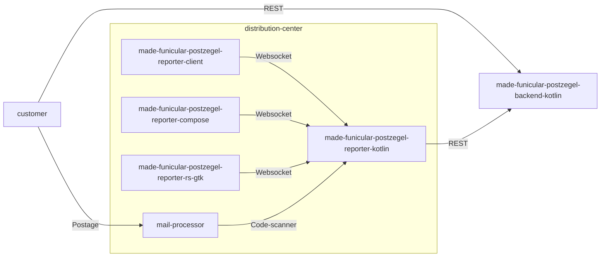
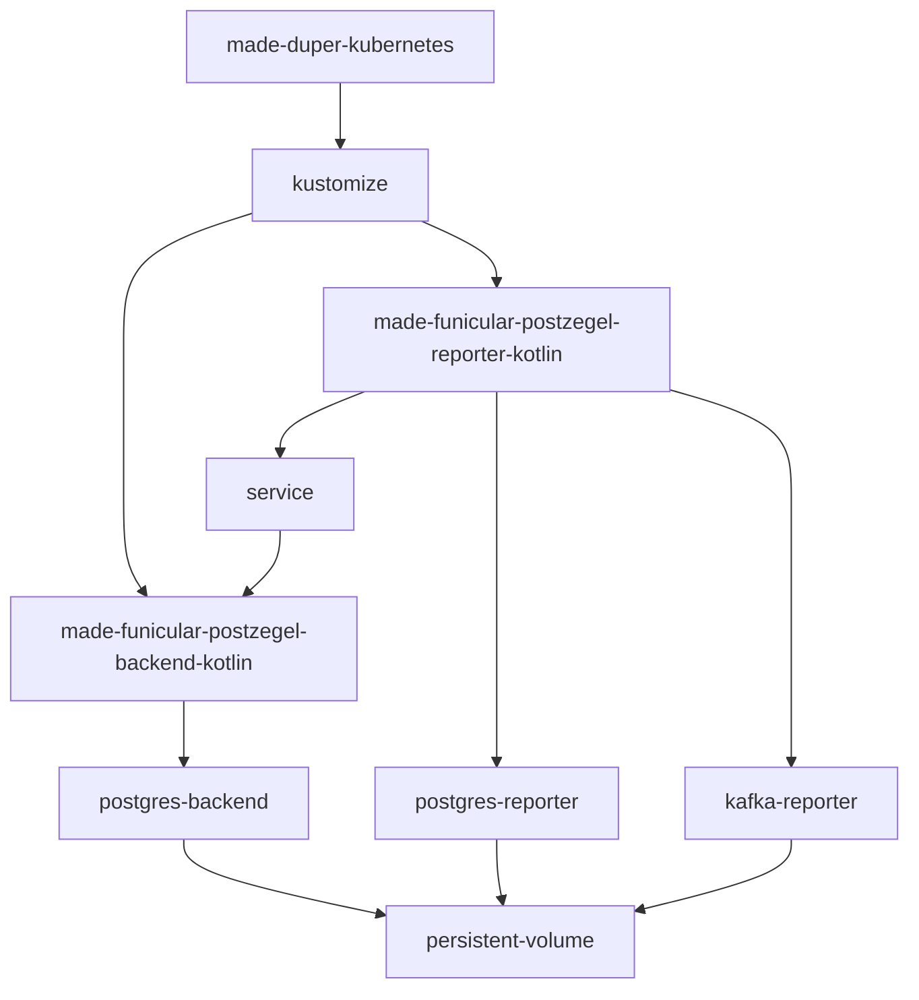

# made-funicular-postzegel
An overview of the umbrella of funicular postzegel. Or stamp in English.

## Interaction diagram

## Deployments

## Repos
- https://github.com/mvandermade/made-duper-kubernetes
- https://github.com/mvandermade/made-funicular-postzegel-reporter-kotlin
- https://github.com/mvandermade/made-funicular-postzegel-backend-kotlin
- https://github.com/mvandermade/made-funicular-postzegel-reporter-rs-gtk
- https://github.com/mvandermade/made-funicular-postzegel-reporter-compose
- https://github.com/mvandermade/made-funicular-postzegel-reporter-client
